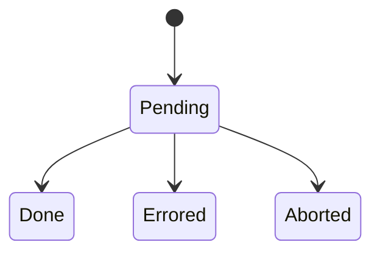

[Storybook](https://react-done-tracker.vercel.app)

# React Done Tracker

Keep track of when an async tree is done rendering.

```bash
npm i react-done-tracker
```

## Example

```tsx
import { TrackDone, useLeafDoneTracker } from "react-done-tracker";

function Image({ src }: { src: string }) {
  const [loadedSrc, setLoadedSrc] = useState();

  useLeafDoneTracker({
    done: loadedSrc === src,
  });

  return  setLoadedSrc(e.target.src)} />;
}

export function App() {
  return (
    <TrackDone onDone={() => console.log("✅")}>
      <Image src={"https://picsum.photos/200"} />
    </TrackDone>
  );
}
```

More examples: see [Storybook](https://react-done-tracker.vercel.app)

## What is React Done Tracker?

### Done Tracker: a primitive for tracking the doneness of an async tree

A done tracker is very simple. It has 4 states: `Pending`, `Done`, `Errored` and `Aborted`.



If you use this library, every async action corresponds to one done tracker.

Once a done tracker is done, errored or aborted, it cannot change its state anymore. If the props of a component change, (e.g. an image src changes), a new done tracker should be made.

### How do you change the state of a done tracker?

There are two types of done trackers:

- Nodes
- Leafs

The rules are quite simple:

- Leaf done trackers are done when they are signaled done.
- Node done trackers are done when all of their children are done.

Leaf done trackers can be signaled done with `doneTracker.signalDone()`.

### What does that look like?

Take for example:

```tsx
<TrackDone>
  <DelayedContainer delay={1000}>
    <Image src={"https://picsum.photos/200"}>
    <Button>Click to make done</Button>
  </DelayedContainer>
  <Image src={"https://picsum.photos/200"}>
</TrackDone>
```

This example would correspond to this tree of done trackers:


The node done trackers in the diagram have rounded corners.

### How do I use it?

This library exposes many utilities to work with done trackers, most of them as React Hooks. Take a look at [Storybook](https://react-done-tracker.vercel.app) for many examples.

### How does this compare to Suspense?

Suspense is used for lazy loading data, and does not render anything to the DOM. React Done Tracker is made to wait for things to render to the DOM.

For example, you cannot use Suspense to wait for a slow canvas to render, or for a video to be loaded into a &lt;video&gt; element.

## More examples

It's best to take a look at [Storybook](https://react-done-tracker.vercel.app) first to get a feeling of how this library can be used.

### Creating a Root done tracker

Contextual API:

```tsx
import { TrackDone } from "react-done-tracker";

function App() {
  return <TrackDone onDone={...} onError={...}>
    <Image src={"https://picsum.photos/200"}>
  </TrackDone>
}
```

Imperative API:

```tsx
import { ImperativeTrackDone } from "react-done-tracker";

function App() {
  return <ImperativeTrackDone onDone={...} onError={...}>{(doneTracker) => (
    <ImperativeImage src={"https://picsum.photos/200"} doneTracker={doneTracker}>
  )}</ImperativeTrackDone>
}
```

### Use a done tracker directly

While you probably don't need to use the done trackers directly, they are quite simple and easy to use:

```tsx
const child1 = new LeafDoneTracker();
const child2 = new LeafDoneTracker();

const parent = new NodeDoneTracker();

parent.add(child1);
parent.add(child2);

child1.signalDone();

assert(!parent.done);

child2.signalDone();

assert(parent.done);
```

Aborting a done tracker (e.g. `child.abort()`) removes it from the parent done tracker.

There are React-specific considerations, mostly to support Strict Mode:

```tsx
const child = new LeafDoneTracker();
const parent = new NodeDoneTracker();

parent.add(child);
child.abort(); // used when a component is torn down

assert(!parent.done);

// after a done tracker aborts, wait one microtask before deciding if the parent is done
// we need this because of double renders in React

queueMicrotask(() => {
  assert(parent.done);
});
```

Errors are also supported:

```tsx
const parent = new NodeDoneTracker();
const subparent = new NodeDoneTracker();
const child = new LeafDoneTracker();

parent.add(subparent);
subparent.add(child);

child.signalError("some error");

assert(parent.errored);
```

### Using a node done tracker

In this example, we tap into the done tracker and set the background color based
on the state of the done tracker.

Contextual API:

```tsx
import { TrackDone, DoneTrackerProvider, useNodeDoneTracker } from "react-done-tracker";

function Tap({ children }) {
  const doneTracker = useNodeDoneTracker({
    name: "Tap",
    willHaveChildren: true
  });

  return (
    <div style={{ background: doneTracker.done ? "green" : "black" }}>
      <DoneTrackerProvider doneTracker={doneTracker}>
        {props.children}
      </DoneTrackerProvider>
    </div>
  );
}

function App() {
  return <TrackDone onDone={...} onError={...}>
    <Tap>
      <Button />
    </Tap>
  </TrackDone>
}
```

### Visualize the state of a subtree

Contextual API:

```tsx
import { TrackDone, visualizeDoneWrapper} from "react-done-tracker";

const VisualizedImage = visualizeDoneWrapper(Image);

function App() {
  return <TrackDone>
    <VisualizedImage src={...}/>
  </TrackDone>
}
```

### Use an inline imperative leaf done tracker

```tsx
import { ForkLeafDoneTracker } from "react-done-tracker";

<ForkLeafDoneTracker>
  {(doneTracker) => (
    <>
      <button onClick={() => doneTracker.signalDone()}>✅ Done</button>
      <button onClick={() => doneTracker.signalError("error")}>❌ Error</button>
    </>
  )}
</ForkLeafDoneTracker>
```
