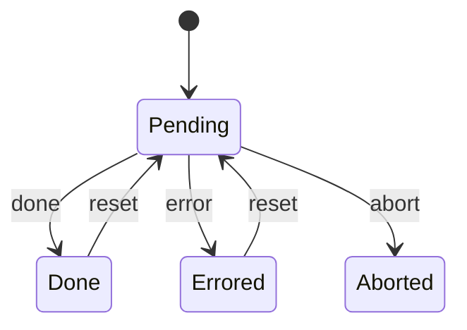
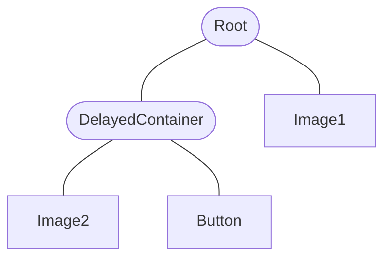

<a href="https://www.npmjs.com/package/react-done-tracker" alt="NPM">
  
</a>
<a href="https://react-done-tracker.vercel.app" alt="Storybook">
  
</a>

# React Done Tracker

Keep track of when an async tree is done rendering.

```bash
npm i react-done-tracker
```

## Example

```tsx
import { TrackDone, useDoneTracker } from "react-done-tracker";

function Image({ src }: { src: string }) {
  const [loadedSrc, setLoadedSrc] = useState();

  useDoneTracker({
    done: loadedSrc === src,
  });

  return  setLoadedSrc(e.target.src)} />;
}

export function App() {
  return (
    <TrackDone onDone={() => console.log("✅")}>
      <Image src={"https://picsum.photos/200"} />
    </TrackDone>
  );
}
```

More examples: see [Storybook](https://react-done-tracker.vercel.app)

## What is React Done Tracker?

### Done Tracker: a primitive for tracking the doneness of an async tree

A done tracker is very simple. It has 4 states: `Pending`, `Done`, `Errored` and `Aborted`.



If you use this library, every async action corresponds to one done tracker.

### How do you change the state of a done tracker?

There are two types of done trackers:

- Leafs (from `useDoneTracker`)
- Nodes (when `useNodeDoneTracker`)

The rules are quite simple:

- Leaf done trackers are done when they are signaled done.
- Node done trackers are done when all of their children are done.

Leaf done trackers can be signaled done with `doneTracker.signalDone()`.

### What does that look like?

Take for example:

```tsx
<TrackDone>
  <DelayedContainer delay={1000}>
    <Image src={"https://picsum.photos/200"}>
    <Button>Click to make done</Button>
  </DelayedContainer>
  <Image src={"https://picsum.photos/200"}>
</TrackDone>
```

This example would correspond to this tree of done trackers:



The node done trackers in the diagram have rounded corners.

### How do I use it?

This library exposes many utilities to work with done trackers, most of them as React Hooks. Take a look at [Storybook](https://react-done-tracker.vercel.app) for many examples.

### How does this compare to Suspense?

Suspense is used for lazy loading data, and does not render anything to the DOM. React Done Tracker is made to wait for things to render to the DOM.

For example, you cannot use Suspense to wait for a slow canvas to render, or for a video to be loaded into a &lt;video&gt; element.

Like Suspense, you can also re-suspend from inside the tree.

You can easily use Done Trackers and Suspense together, see [this example](https://react-done-tracker.vercel.app?path=/docs/contextual-api-suspense--docs).

### How can I debug this?

Run `window.__debug_react_done_tracker = true` before importing the library, and you will see logs of done tracker events, as well as the state of a done tracker tree when its doneness is being checked.

You can print the state of a done tracker tree to the console with `doneTracker.log()`.

Next to that, the `useDoneTrackerRaw` hook uses `useDebugValue` which displays the done tracker state in React DevTools.

### What if I have a node that doesn't render all its children immediately?

In this case you can add `skip: true` to the `useNodeDoneTracker` call until the children have been added.

e.g.

```tsx
const Tree = () => {
  const [delaying, setDelaying] = useState(true);
  useDoneTracker({
    name: "Async operation",
    done: !delaying,
  });
  const subtreeDoneTracker = useNodeDoneTracker({
    name: "Subtree",
    skip: delaying,
  });

  useEffect(() => {
    if (!delaying) return;
    const timeoutId = setTimeout(() => setDelaying(false), 2000);
    return () => clearTimeout(timeoutId);
  }, [delaying]);

  if (delaying) return <>Delaying...</>;
  return (
    <DoneTrackerProvider doneTracker={subtreeDoneTracker}>
      <DelayedComponent delay={1000} />
    </DoneTrackerProvider>
  );
}
```

## More examples

It's best to take a look at [Storybook](https://react-done-tracker.vercel.app) first to get a feeling of how this library can be used.

### Creating a Root done tracker

Contextual API:

```tsx
import { TrackDone } from "react-done-tracker";

function App() {
  return <TrackDone onDone={...} onError={...}>
    <Image src={"https://picsum.photos/200"}>
  </TrackDone>
}
```

Imperative API:

```tsx
import { ImperativeTrackDone } from "react-done-tracker";

function App() {
  return <ImperativeTrackDone onDone={...} onError={...}>{(doneTracker) => (
    <ImperativeImage src={"https://picsum.photos/200"} doneTracker={doneTracker}>
  )}</ImperativeTrackDone>
}
```

### Use a done tracker directly

While you probably don't need to use the done trackers directly, they are quite simple and easy to use:

```tsx
const child1 = new LeafDoneTracker();
const child2 = new LeafDoneTracker();

const parent = new NodeDoneTracker();

parent.add(child1);
parent.add(child2);

child1.signalDone();

assert(!parent.done);

child2.signalDone();

assert(parent.done);
```

When using `useDoneTracker`, you obtain a `LeafDoneTracker`.

Aborting a done tracker (e.g. `child.abort()`) removes it from the parent done tracker.

```tsx
const child = new LeafDoneTracker();
const parent = new NodeDoneTracker();

parent.add(child);
child.abort(); // used when a component is torn down

assert(parent.done);
```

Errors are also supported:

```tsx
const parent = new NodeDoneTracker();
const subparent = new NodeDoneTracker();
const child = new LeafDoneTracker();

parent.add(subparent);
subparent.add(child);

child.signalError("some error");

assert(parent.errored);
```

### Using a node done tracker

In this example, we tap into the done tracker and set the background color based
on the state of the done tracker.

Contextual API:

```tsx
import { TrackDone, DoneTrackerProvider, useNodeDoneTracker } from "react-done-tracker";

function Tap({ children }) {
  const doneTracker = useNodeDoneTracker({ name: "Tap" });

  return (
    <div style={{ background: doneTracker.done ? "green" : "black" }}>
      <DoneTrackerProvider doneTracker={doneTracker}>
        {props.children}
      </DoneTrackerProvider>
    </div>
  );
}

function App() {
  return <TrackDone onDone={...} onError={...}>
    <Tap>
      <Button />
    </Tap>
  </TrackDone>
}
```

### Make a done tracked hook

```tsx
// from @tanstack/react-query
const useQueryDoneTracked = doneTrackHook(useQuery, { isDone: (result) => !result.isLoading });

// from react-async-hook
const useAsyncDoneTracked = doneTrackHook(
  useAsync,
  { isDone: (result, args) => !result.loading && isEqual(result.currentParams, args[1]) }
);
```

### Visualize the state of a subtree

Contextual API:

```tsx
import { TrackDone, visualizeDoneWrapper} from "react-done-tracker";

const VisualizedImage = visualizeDoneWrapper(Image);

function App() {
  return <TrackDone>
    <VisualizedImage src={...}/>
  </TrackDone>
}
```

### Use an inline imperative leaf done tracker

```tsx
import { ForkLeafDoneTracker } from "react-done-tracker";

<ForkLeafDoneTracker>
  {(doneTracker) => (
    <>
      <button onClick={() => doneTracker.signalDone()}>✅ Done</button>
      <button onClick={() => doneTracker.signalError("error")}>❌ Error</button>
    </>
  )}
</ForkLeafDoneTracker>
```

## Change event

In certain situations, it's useful to know when the children of a certain component have changed, e.g. when you want to screenshot those components after a change. On first load, you can wait for a `done` event. But when the children change in a non-async way, there will not be a second `done` event.

Because of that, you can trigger the `change` event if you want a parent component to know that the children have changed.

```tsx
// child
useEffect(() => {
  doneTracker.signalChange();
}, [doneTracker, dep]);

// parent
useDoneTrackerSubscription(doneTracker, {
  change: () => console.log("children have changed")
});
```

As a shorthand, you can use `useSignalChange`, which will create a new done tracker:

```tsx
useSignalChange("Dep watcher", [dep]);
```

The `change` event is not part of the "core" of this library. It was added because it's commonly needed.

## Caveats

### Slow hooks

Slow hooks are hooks that don't update their loading state immediately.

For example:

```tsx
const useSlow = (input: any) => {
  const [output, setOutput] = useState<any>(null);
  const [loading, setLoading] = useState(true);

  useEffect(() => {
    setLoading(true);
    const timeoutId = setTimeout(() => {
      setLoading(false);
      setOutput(input);
    }, 1000);
    return () => clearTimeout(timeoutId);
  }, [input]);

  // (this hook could be fixed by using `loading = loading || input !== output`)
  return [output, loading] as const;
};

const Component = (props: { value: any }) => {
  const [slowState, loading] = useSlow(props.value);

  useDoneTracker({
    name: "Loading",
    done: !loading
  });

  return <>
    <LoadSomething value={props.value} />
    <div>{slowState}</div>
  </>
}
```

In this case, `useSlow2` is a slow hook, because the loading variable is delayed.

This can lead to problems in this case:
- a new value comes in through the props
- LoadSomething signals done immediately
- this causes the root done tracker to recalculate its state
- the Loading done tracker is done, because the loading variable is delayed
- the root done tracker is done
- the useEffect runs
- the Loading done tracker resets
- the root done tracker is pending again

We can fix it by making sure the loading state in `useSlow` is accurate:

```ts
const actualLoading = loading || input !== output;

return [output, actualLoading] as const;
```

From experience I know that there are a few slow hooks in the wild, like `react-async-hook`.

This library also provides utility functions to fix these kinds of "misbehaving" hooks:

```ts
import isDeepEqual from "fast-deep-equal";

// compare input and output to know if the hook is done (preferred)
// this is not always possible, because the result and args are not always easily comparable
const useAsyncFixed = doneTrackHook(
  useAsync,
  { isDone: (result, args) => isDeepEqual(result.currentParams, args[1]) }
);

// wait 2 extra useEffect cycles on each change (less preferred)
const useAsyncFixed = doneTrackSlowHookWithEffectsDelay(
  useAsync,
  {
    waitEffects: 2,
    argsEqual: (a, b) => isDeepEqual(a[1], b[1]),
  }
);

// wait 100ms on each args change (not preferred, very dirty)
const useAsyncFixed = doneTrackSlowHookWithDelay(
  useAsync,
  {
    delay: 100,
    argsEqual: (a, b) => isDeepEqual(a[1], b[1]),
  }
);
```

You will likely never see this problem unless you heavily use this library, but it is worth being aware of.
A warning will be logged when the time between done and reset is very short, in order to debug the root cause.
