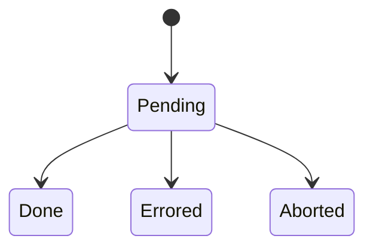

[Storybook](https://react-done-tracker.vercel.app)

# React Done Tracker

Keep track of when an async tree is done rendering.

```bash
npm i react-done-tracker
```

### Examples

```tsx
import { TrackDone, useLeafDoneTracker } from "react-done-tracker";

function Image({ src }: { src: string }) {
  const [loadedSrc, setLoadedSrc] = useState();

  useLeafDoneTracker({
    done: loadedSrc === src
  });

  return  setLoadedSrc(e.target.src)} />
}

export function App() {
  return <TrackDone onDone={() => console.log("✅")}>
    <Image src={"https://picsum.photos/200"} />
  </TrackDone>
}
```

More examples: see [Storybook](https://react-done-tracker.vercel.app)

## What is React Done Tracker?

### Done Tracker: a primitive for tracking the doneness of an async tree

A done tracker is very simple. It has 4 states: `Pending`, `Done`, `Errored` and `Aborted`.



If you use this library, every async action corresponds to one done tracker.

Once a done tracker is done, errored or aborted, it cannot change its state anymore. If the props of a component change, (e.g. an image src changes), a new done tracker should be made.

### How do you change the state of a done tracker?

There are two types of done trackers:
- Nodes
- Leafs

The rules are quite simple:

- Leaf done trackers are done when they are signaled done.
- Node done trackers are done when all of their children are done.

Leaf done trackers can be signaled done with `doneTracker.signalDone()`.

### What does that look like?

Take for example:

```tsx
<TrackDone>
  <DelayedContainer delay={1000}>
    <Image src={"https://picsum.photos/200"}>
    <Button>Click to make done</Button>
  </DelayedContainer>
  <Image src={"https://picsum.photos/200"}>
</TrackDone>
```

This example would correspond to this tree of done trackers:


The node done trackers in the diagram have rounded corners.

### How do I use it?

This library exposes many utilities to work with done trackers, most of them as React Hooks. Take a look at [Storybook](https://react-done-tracker.vercel.app) for many examples.

### How does this compare to Suspense?

Suspense is used for lazy loading data, and does not render anything to the DOM. React Done Tracker is made to wait for things to render to the DOM.

For example, you cannot use Suspense to wait for a slow canvas to render, or for a video to be loaded into a &lt;video&gt; element.
